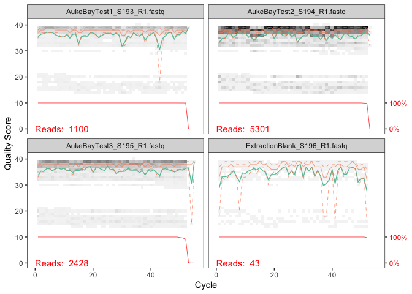
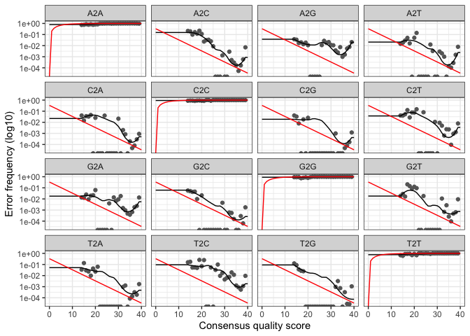

dada2
================
diana baetscher
2025-08-19

``` r
library(dada2)
```

    ## Warning: package 'dada2' was built under R version 4.2.1

    ## Loading required package: Rcpp

``` r
library(tidyverse)
```

    ## ── Attaching core tidyverse packages ──────────────────────── tidyverse 2.0.0 ──
    ## ✔ dplyr     1.1.4     ✔ readr     2.1.4
    ## ✔ forcats   1.0.0     ✔ stringr   1.5.1
    ## ✔ ggplot2   3.5.1     ✔ tibble    3.2.1
    ## ✔ lubridate 1.9.3     ✔ tidyr     1.3.1
    ## ✔ purrr     1.0.2

    ## ── Conflicts ────────────────────────────────────────── tidyverse_conflicts() ──
    ## ✖ dplyr::filter() masks stats::filter()
    ## ✖ dplyr::lag()    masks stats::lag()
    ## ℹ Use the conflicted package (<http://conflicted.r-lib.org/>) to force all conflicts to become errors

``` r
# file location
path <- "../data/HAPO_test/trimmed"

list.files(path)
```

    ##  [1] "AukeBayTest1_S193_R1_trimmed.fastq" "AukeBayTest1_S193_R1.fastq"        
    ##  [3] "AukeBayTest1_S193_R2_trimmed.fastq" "AukeBayTest1_S193_R2.fastq"        
    ##  [5] "AukeBayTest2_S194_R1.fastq"         "AukeBayTest2_S194_R2.fastq"        
    ##  [7] "AukeBayTest3_S195_R1.fastq"         "AukeBayTest3_S195_R2.fastq"        
    ##  [9] "ExtractionBlank_S196_R1.fastq"      "ExtractionBlank_S196_R2.fastq"     
    ## [11] "filtered"                           "NegativeControl_S197_R1.fastq"     
    ## [13] "NegativeControl_S197_R2.fastq"

``` r
fnFs <- sort(list.files(path, pattern = "_R1.fastq", full.names = TRUE))
#fnRs <- sort(list.files(path, pattern = "_R2.fastq", full.names = TRUE))
# Extract sample names, assuming filenames have format: SAMPLENAME_XXX.fastq
sample.names <- sapply(strsplit(basename(fnFs), "_"), `[`, 1)
```

``` r
plotQualityProfile(fnFs[1:4])
```

    ## Warning: The `<scale>` argument of `guides()` cannot be `FALSE`. Use "none" instead as
    ## of ggplot2 3.3.4.
    ## ℹ The deprecated feature was likely used in the dada2 package.
    ##   Please report the issue at <https://github.com/benjjneb/dada2/issues>.
    ## This warning is displayed once every 8 hours.
    ## Call `lifecycle::last_lifecycle_warnings()` to see where this warning was
    ## generated.

<!-- -->

``` r
#plotQualityProfile(fnRs[1:2])
```

Read1 looks good for the full 76 bp, Read2 looks good for ~50 bp. The
data shouldn’t overlap because the insert size is ~379 bp. Worth
processing both reads separately and not merging?

``` r
# Place filtered files in filtered/ subdirectory
filtFs <- file.path(path, "filtered", paste0(sample.names, "_F_filt.fastq.gz"))
#filtRs <- file.path(path, "filtered", paste0(sample.names, "_R_filt.fastq.gz"))
names(filtFs) <- sample.names
#names(filtRs) <- sample.names
```

I think I just need to process the Fwd reads

``` r
out <- filterAndTrim(fnFs, filtFs,
              maxN=0, maxEE=10, truncQ=5, rm.phix=TRUE,
              compress=TRUE, multithread=TRUE) 
```

    ## Some input samples had no reads pass the filter.

``` r
# out <- filterAndTrim(fnFs, filtFs, fnRs, filtRs, truncLen=c(76,50),
#               maxN=0, maxEE=c(2,4), truncQ=2, rm.phix=TRUE,
#               compress=TRUE, multithread=TRUE) 
head(out)
```

    ##                               reads.in reads.out
    ## AukeBayTest1_S193_R1.fastq        1100      1100
    ## AukeBayTest2_S194_R1.fastq        5301      5301
    ## AukeBayTest3_S195_R1.fastq        2428      2428
    ## ExtractionBlank_S196_R1.fastq       43        43
    ## NegativeControl_S197_R1.fastq        0         0

Those filters worked decently for now - keeping a majority of the reads.

``` r
# ensure there are no samples without reads
# as these don't work in the next steps
out %>%
  as.data.frame() %>%
  filter(reads.out <1)
```

    ##                               reads.in reads.out
    ## NegativeControl_S197_R1.fastq        0         0

``` r
# filter the matrix to retain samples with >0 reads
```

Let’s move fwd with these for now… and come back if there are other
issues.

### Error rates

``` r
my_list <- as.list(filtFs)
  
new_list <- my_list[-5]

# fwd error rates
errF <- learnErrors(new_list, multithread=TRUE)
```

    ## 460860 total bases in 8872 reads from 4 samples will be used for learning the error rates.

``` r
# reverse error rates
#errR <- learnErrors(filtRs, multithread=TRUE)

# plot the erors
p1 <- plotErrors(errF, nominalQ=TRUE)
#p2 <- plotErrors(errR, nominalQ=TRUE)

p1
```

    ## Warning in scale_y_log10(): log-10 transformation introduced infinite values.
    ## log-10 transformation introduced infinite values.

<!-- -->

### Sample inference

``` r
filtF <- as.character(new_list) # change the list back to a character vector for the function

# forwards
dadaFs <- dada(filtF, err=errF, multithread=TRUE)
```

    ## Sample 1 - 1100 reads in 170 unique sequences.
    ## Sample 2 - 5301 reads in 442 unique sequences.
    ## Sample 3 - 2428 reads in 352 unique sequences.
    ## Sample 4 - 43 reads in 24 unique sequences.

``` r
# reverses
#dadaRs <- dada(filtRs, err=errR, pool="pseudo", multithread=TRUE)
```

Make a sequence table

``` r
seqtab <- makeSequenceTable(dadaFs)
dim(seqtab)
```

    ## [1]  4 27

``` r
# Inspect distribution of sequence lengths
table(nchar(getSequences(seqtab)))
```

    ## 
    ## 49 50 51 52 
    ##  1  2  5 19

Let’s remove the singletons and off-target sequences

``` r
seqtab2 <- seqtab[,nchar(colnames(seqtab)) %in% 52]
```

Remove chimeras

``` r
seqtab.nochim <- removeBimeraDenovo(seqtab2, method="consensus", multithread=TRUE, verbose=TRUE)
```

    ## Identified 0 bimeras out of 19 input sequences.

``` r
dim(seqtab.nochim)
```

    ## [1]  4 19

Calculate frequency of chimeras

``` r
sum(seqtab.nochim)/sum(seqtab2)
```

    ## [1] 1

Track reads through the pipeline

``` r
# getN <- function(x) sum(getUniques(x))
# track <- cbind(out, sapply(dadaFs, getN), sapply(dadaRs, getN), sapply(mergers, getN), rowSums(seqtab.nochim))
# 
# colnames(track) <- c("input", "filtered", "denoisedF", "denoisedR", "merged", "nonchim")
# rownames(track) <- sample.names
# head(track)
```

## Export files for taxonomy and samples/ASVs

``` r
 #make fasta file with ASVs
    asv_seqs=colnames(seqtab.nochim)
    for(i in 1:length(asv_seqs))
    {
        write.table(paste(">ASV",i, sep=""),file="csv_outputs/HAPO_test_ASV.csv", append=TRUE, col.names = F, row.names = F, quote=F)
        write.table(paste(asv_seqs[i], sep=""),file="csv_outputs/HAPO_test_ASV.csv", append=TRUE, col.names = F, row.names = F, quote=F)
    }
```

That’s the input for the FASTA blastn search.

Goal: change ASV headers to numbered ASVs that correspond to those
output in the FASTA file.

``` r
# Make map between brief names and full sequences
briefToSeq <- colnames(seqtab.nochim)
names(briefToSeq) <- paste0("ASV", seq(ncol(seqtab.nochim))) # Seq1, Seq2, ...
# Make new sequence table with brief names
st.brief <- seqtab.nochim
colnames(st.brief) <- names(briefToSeq)

# export the pool seq table with brief names:
write.csv(st.brief, file="csv_outputs/hapo_ASVtable.csv")
```

Quick combine:

``` r
as.data.frame(seqtab.nochim) %>%
  rownames_to_column(var = "sample") %>%
  pivot_longer(2:20, names_to = "ASV", values_to = "reads") %>%
  filter(reads > 0) %>%
  arrange(-reads) %>%
  write_csv("csv_outputs/AukeRec_hapo_df.csv")
```

``` r
as.data.frame(seqtab.nochim) %>%
  rownames_to_column(var = "sample") %>%
  pivot_longer(2:20, names_to = "ASV", values_to = "reads") %>%
  filter(reads > 0) %>%
  arrange(-reads) %>%
  filter(sample != "ExtractionBlank_F_filt.fastq.gz") %>%
  group_by(ASV) %>%
  summarise(total_reads = sum(reads)) %>%
  arrange(-total_reads)
```

    ## # A tibble: 19 × 2
    ##    ASV                                                  total_reads
    ##    <chr>                                                      <int>
    ##  1 GGAAGTACAGCGGATGAGTAACCATAAAACTCGGAAAAAGCATCTGGTTCTT        5236
    ##  2 TGTTTATTAAAGCACTACTGTACTACGTCAGTATTAAAAATAGCCTACTCCT        2121
    ##  3 GCATGTTGTTGTACCACTGCATGAATGTCATCAGACAGACAGAGATCAACTT         398
    ##  4 CAACAAGATGCGTCCGCGCCAGTAGAGGAACTCAGGCATCTGAATGAACTTG         167
    ##  5 CTGGTCAGCGCCTTGAATGCAGATTGTTTAGGCCCTGTTGAATTGACGGTGG         161
    ##  6 GTTGGCCCTGATAGTATAGAAGCATCTTTACCACGGCTCAAGCATTGGTTGG         144
    ##  7 CCGATGGTTATCTTTACCTGGATTCTCAACTTCGGTGTACAGGGCACGGTGC          94
    ##  8 GTCAACTGTAACTTTTTTGTTTGCTAAATCATCTGGTTCTTACTTCAGGACC          44
    ##  9 TCGAGATATCCTCGCATCGATGGCTTGCCTCGTAATTTATCCAGACGCCAGG          37
    ## 10 GTTGGCCCTGATAGTATACAAGCATCTTTACCACGGCTCAAGTATTGGTTGG          34
    ## 11 CTGCCGTAAACTTGTCAGTCATTACTTACGCTTTGCTGCTCTTGCATCTGCT          29
    ## 12 GAACTCTGGACCTGTCGCATCTGGTTCTTACTTCAGGACCATAGATCGGAAG          25
    ## 13 CCGATGGTTATCTTTACCTGGATTCTCAACTTTGGTGTTCAGGGCACGGTGC          21
    ## 14 TGACCAATTCCACATACATCCTCAAATGGTCGGAACCTCAATGACTCGGTTC          20
    ## 15 CCGATGGTTATATTTACTTGGATTCTCAACTTTGGTGTACAGGGCACGGTGC          12
    ## 16 AATAATTCCCATATCGGCCACTATTTTAGGGTCATCTGGTTCTTACTTCAGG          10
    ## 17 CTGCGGTATACTTGTCAGTCATTACTTACGCTTTGCTGCTCTTGCATCTGCT          10
    ## 18 TGCCTTTACAGTTTCTTCTGTTAATGCTACTTCAGCTCTACCACTTAAAAGC           3
    ## 19 TAACCTAACTTATCTGGTTGAGTGCTTAGGTAGGTGATGTTATATTGATAGT           2
