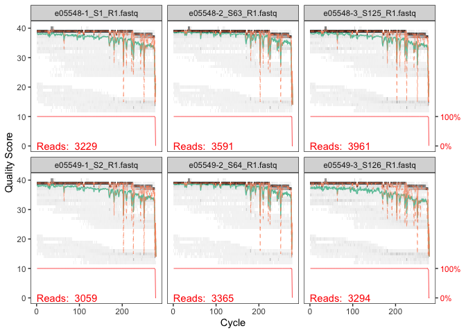
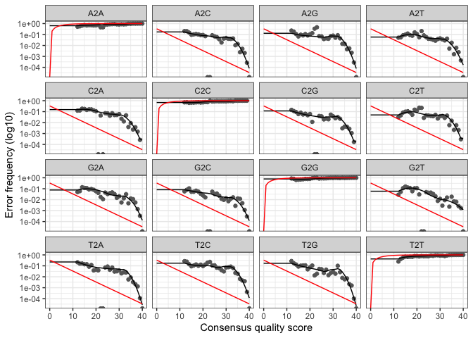
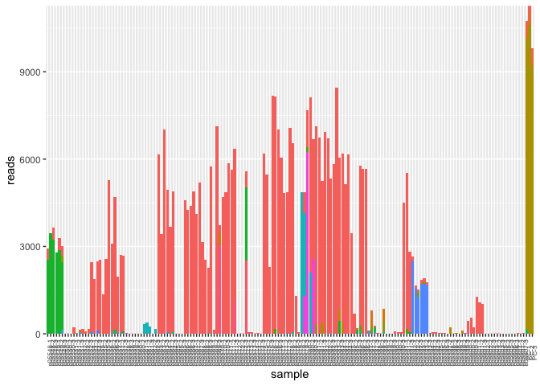
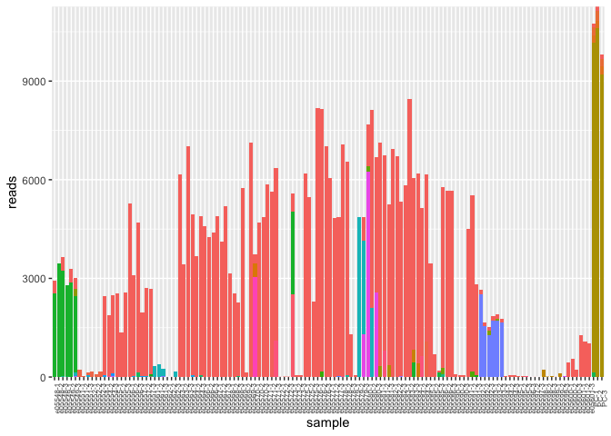

microkit-20260324
================
diana baetscher
2026-03-26

Here I’m analyzing the harbor porpoise data that Jamie generated on a
MiSeq single-end 300 bp microkit.

There was 60% PhiX aligned, despite using a more stringent gel
extraction (\>600 bp) and quantifying the libraries using both the Kapa
qPCR kit for Illumina and the Qubit.

Based on the last microkit run, I’ll start with the forward primers
since those contained usable sequence data previously.

The first few steps are outside of R, using cutadapt to trim primers.

``` sh
# preliminaries to get cutadapt going
(base) AKCJM140-DB23:cutadapt_mismatches diana.baetscher$ conda activate cutadaptenv

DATA=/Users/diana.baetscher/git-repos/HAPO/data/20260324_HAPOeDNA/rawdata

# below, the first set of () creates an array, containing n elements of the desired trimmed and unique names
NAMELIST=$(ls ${DATA} | sed 's/e*_L001.*//' | uniq)
echo "${NAMELIST}"
```

``` sh
# cutadapt remove primers
# single-end, unsure of which side we're sequencing... begin with the forward primer, which has the `-g` for indicating it is the 5' end, not the 3' end:
for i in ${NAMELIST}; do
    cutadapt --discard-untrimmed -g TACTCCTTGAAAAAGCCCATTGTA -o trimmed/${i}_R1.fastq.gz "$DATA/${i}_L001_R1_001.fastq.gz" >> cutadapt_fwd_out.txt
    done


# then unzip the reads in the /trimmed directory
pigz -d *gz
```

There are some empty files - go ahead and move those to a different
directory now.

``` sh
find /Users/diana.baetscher/git-repos/HAPO/data/20260324_HAPOeDNA/trimmed -type f -empty -exec mv {} /Users/diana.baetscher/git-repos/HAPO/data/20260324_HAPOeDNA/trimmed_empty/ \;
```

## Dada2 and ASV analysis

Launching into the R-portion of the analysis in dada2

``` r
library(dada2)
```

    ## Warning: package 'dada2' was built under R version 4.2.1

    ## Loading required package: Rcpp

``` r
library(tidyverse)
```

    ## ── Attaching core tidyverse packages ──────────────────────── tidyverse 2.0.0 ──
    ## ✔ dplyr     1.1.4     ✔ readr     2.1.4
    ## ✔ forcats   1.0.0     ✔ stringr   1.6.0
    ## ✔ ggplot2   3.5.1     ✔ tibble    3.2.1
    ## ✔ lubridate 1.9.3     ✔ tidyr     1.3.0
    ## ✔ purrr     1.0.2

    ## ── Conflicts ────────────────────────────────────────── tidyverse_conflicts() ──
    ## ✖ dplyr::filter() masks stats::filter()
    ## ✖ dplyr::lag()    masks stats::lag()
    ## ℹ Use the conflicted package (<http://conflicted.r-lib.org/>) to force all conflicts to become errors

``` r
# file location
path <- "../data/20260324_HAPOeDNA/trimmed"

list.files(path)
```

    ##   [1] "e05548-1_S1_R1.fastq"   "e05548-2_S63_R1.fastq"  "e05548-3_S125_R1.fastq"
    ##   [4] "e05549-1_S2_R1.fastq"   "e05549-2_S64_R1.fastq"  "e05549-3_S126_R1.fastq"
    ##   [7] "e05550-1_S3_R1.fastq"   "e05550-2_S65_R1.fastq"  "e05550-3_S127_R1.fastq"
    ##  [10] "e05551-1_S4_R1.fastq"   "e05551-2_S66_R1.fastq"  "e05551-3_S128_R1.fastq"
    ##  [13] "e05552-1_S5_R1.fastq"   "e05552-2_S67_R1.fastq"  "e05552-3_S129_R1.fastq"
    ##  [16] "e05553-3_S130_R1.fastq" "e05554-1_S7_R1.fastq"   "e05554-2_S69_R1.fastq" 
    ##  [19] "e05554-3_S131_R1.fastq" "e05555-1_S8_R1.fastq"   "e05555-2_S70_R1.fastq" 
    ##  [22] "e05555-3_S132_R1.fastq" "e05556-1_S9_R1.fastq"   "e05556-2_S71_R1.fastq" 
    ##  [25] "e05556-3_S133_R1.fastq" "e05557-1_S10_R1.fastq"  "e05557-2_S72_R1.fastq" 
    ##  [28] "e05557-3_S134_R1.fastq" "e05558-1_S11_R1.fastq"  "e05558-2_S73_R1.fastq" 
    ##  [31] "e05558-3_S135_R1.fastq" "e05559-1_S13_R1.fastq"  "e05559-2_S75_R1.fastq" 
    ##  [34] "e05559-3_S137_R1.fastq" "e05560-1_S14_R1.fastq"  "e05560-2_S76_R1.fastq" 
    ##  [37] "e05560-3_S138_R1.fastq" "e05561-1_S15_R1.fastq"  "e05561-2_S77_R1.fastq" 
    ##  [40] "e05561-3_S139_R1.fastq" "e05562-1_S16_R1.fastq"  "e05562-2_S78_R1.fastq" 
    ##  [43] "e05562-3_S140_R1.fastq" "e05563-1_S17_R1.fastq"  "e05563-2_S79_R1.fastq" 
    ##  [46] "e05563-3_S141_R1.fastq" "e05564-1_S18_R1.fastq"  "e05564-2_S80_R1.fastq" 
    ##  [49] "e05564-3_S142_R1.fastq" "e05565-1_S19_R1.fastq"  "e05565-2_S81_R1.fastq" 
    ##  [52] "e05565-3_S143_R1.fastq" "e05566-1_S20_R1.fastq"  "e05566-2_S82_R1.fastq" 
    ##  [55] "e05566-3_S144_R1.fastq" "e05567-1_S21_R1.fastq"  "e05567-2_S83_R1.fastq" 
    ##  [58] "e05567-3_S145_R1.fastq" "e05568-1_S22_R1.fastq"  "e05568-2_S84_R1.fastq" 
    ##  [61] "e05568-3_S146_R1.fastq" "e05569-1_S23_R1.fastq"  "e05569-2_S85_R1.fastq" 
    ##  [64] "e05569-3_S147_R1.fastq" "e05570-1_S25_R1.fastq"  "e05570-2_S87_R1.fastq" 
    ##  [67] "e05570-3_S149_R1.fastq" "e05571-1_S26_R1.fastq"  "e05571-2_S88_R1.fastq" 
    ##  [70] "e05571-3_S150_R1.fastq" "e05572-1_S27_R1.fastq"  "e05572-2_S89_R1.fastq" 
    ##  [73] "e05572-3_S151_R1.fastq" "e05573-1_S28_R1.fastq"  "e05573-2_S90_R1.fastq" 
    ##  [76] "e05573-3_S152_R1.fastq" "e05574-1_S29_R1.fastq"  "e05574-2_S91_R1.fastq" 
    ##  [79] "e05574-3_S153_R1.fastq" "e05575-1_S30_R1.fastq"  "e05575-2_S92_R1.fastq" 
    ##  [82] "e05575-3_S154_R1.fastq" "e05576-1_S31_R1.fastq"  "e05576-2_S93_R1.fastq" 
    ##  [85] "e05576-3_S155_R1.fastq" "e05577-1_S32_R1.fastq"  "e05577-2_S94_R1.fastq" 
    ##  [88] "e05577-3_S156_R1.fastq" "e05578-1_S33_R1.fastq"  "e05578-2_S95_R1.fastq" 
    ##  [91] "e05578-3_S157_R1.fastq" "e05579-1_S34_R1.fastq"  "e05579-2_S96_R1.fastq" 
    ##  [94] "e05579-3_S158_R1.fastq" "e05580-1_S35_R1.fastq"  "e05580-2_S97_R1.fastq" 
    ##  [97] "e05580-3_S159_R1.fastq" "e05581-1_S37_R1.fastq"  "e05581-2_S99_R1.fastq" 
    ## [100] "e05581-3_S161_R1.fastq" "e05582-1_S38_R1.fastq"  "e05582-2_S100_R1.fastq"
    ## [103] "e05582-3_S162_R1.fastq" "e05583-1_S39_R1.fastq"  "e05583-2_S101_R1.fastq"
    ## [106] "e05583-3_S163_R1.fastq" "e05584-1_S40_R1.fastq"  "e05584-2_S102_R1.fastq"
    ## [109] "e05584-3_S164_R1.fastq" "e05585-1_S41_R1.fastq"  "e05585-2_S103_R1.fastq"
    ## [112] "e05585-3_S165_R1.fastq" "e05586-1_S42_R1.fastq"  "e05586-2_S104_R1.fastq"
    ## [115] "e05586-3_S166_R1.fastq" "e05587-1_S43_R1.fastq"  "e05587-2_S105_R1.fastq"
    ## [118] "e05587-3_S167_R1.fastq" "e05588-1_S44_R1.fastq"  "e05588-2_S106_R1.fastq"
    ## [121] "e05588-3_S168_R1.fastq" "e05589-1_S45_R1.fastq"  "e05589-2_S107_R1.fastq"
    ## [124] "e05589-3_S169_R1.fastq" "e05590-1_S46_R1.fastq"  "e05590-2_S108_R1.fastq"
    ## [127] "e05590-3_S170_R1.fastq" "e05591-1_S47_R1.fastq"  "e05591-2_S109_R1.fastq"
    ## [130] "e05591-3_S171_R1.fastq" "e05592-1_S49_R1.fastq"  "e05592-2_S111_R1.fastq"
    ## [133] "e05592-3_S173_R1.fastq" "e05593-1_S50_R1.fastq"  "e05593-2_S112_R1.fastq"
    ## [136] "e05593-3_S174_R1.fastq" "e05594-1_S51_R1.fastq"  "e05594-2_S113_R1.fastq"
    ## [139] "e05594-3_S175_R1.fastq" "e05595-1_S52_R1.fastq"  "e05595-2_S114_R1.fastq"
    ## [142] "e05595-3_S176_R1.fastq" "e05596-3_S177_R1.fastq" "e05597-2_S116_R1.fastq"
    ## [145] "e05597-3_S178_R1.fastq" "e05598-1_S55_R1.fastq"  "e05598-2_S117_R1.fastq"
    ## [148] "e05598-3_S179_R1.fastq" "e05599-1_S56_R1.fastq"  "e05599-2_S118_R1.fastq"
    ## [151] "e05599-3_S180_R1.fastq" "e05600-1_S57_R1.fastq"  "e05600-2_S119_R1.fastq"
    ## [154] "e05600-3_S181_R1.fastq" "e05601-1_S58_R1.fastq"  "e05601-2_S120_R1.fastq"
    ## [157] "e05601-3_S182_R1.fastq" "e05602-1_S59_R1.fastq"  "e05602-2_S121_R1.fastq"
    ## [160] "e05602-3_S183_R1.fastq" "e05603-1_S12_R1.fastq"  "e05603-2_S74_R1.fastq" 
    ## [163] "e05603-3_S136_R1.fastq" "e05604-1_S24_R1.fastq"  "e05604-2_S86_R1.fastq" 
    ## [166] "e05604-3_S148_R1.fastq" "e05605-1_S36_R1.fastq"  "e05605-2_S98_R1.fastq" 
    ## [169] "e05605-3_S160_R1.fastq" "e05606-1_S48_R1.fastq"  "e05606-2_S110_R1.fastq"
    ## [172] "e05606-3_S172_R1.fastq" "e05607-1_S60_R1.fastq"  "e05607-2_S122_R1.fastq"
    ## [175] "e05607-3_S184_R1.fastq" "filtered"               "PC-1_S62_R1.fastq"     
    ## [178] "PC-2_S124_R1.fastq"     "PC-3_S186_R1.fastq"

``` r
fnFs <- sort(list.files(path, pattern = "_R1.fastq", full.names = TRUE))
#fnRs <- sort(list.files(path, pattern = "_R2.fastq", full.names = TRUE))
# Extract sample names, assuming filenames have format: SAMPLENAME_XXX.fastq
sample.names <- sapply(strsplit(basename(fnFs), "_"), `[`, 1)
```

``` r
plotQualityProfile(fnFs[1:6])
```

    ## Warning: The `<scale>` argument of `guides()` cannot be `FALSE`. Use "none" instead as
    ## of ggplot2 3.3.4.
    ## ℹ The deprecated feature was likely used in the dada2 package.
    ##   Please report the issue at <https://github.com/benjjneb/dada2/issues>.
    ## This warning is displayed once per session.
    ## Call `lifecycle::last_lifecycle_warnings()` to see where this warning was
    ## generated.

<!-- -->

``` r
#plotQualityProfile(fnRs[1:2])
```

Those look much better than the previous run… nice!

``` r
# Place filtered files in filtered/ subdirectory
filtFs <- file.path(path, "filtered", paste0(sample.names, "_F_filt.fastq.gz"))
names(filtFs) <- sample.names
```

I think I just need to process the Fwd reads

``` r
# trim reads using the quality scores
# 200 worked well, let's try 250 and see what we get
out <- filterAndTrim(fnFs, filtFs, truncLen = 275,
              maxN=0, truncQ=10, rm.phix=TRUE,
              compress=TRUE, multithread=TRUE) 

head(out)
```

    ##                        reads.in reads.out
    ## e05548-1_S1_R1.fastq       3229      3226
    ## e05548-2_S63_R1.fastq      3591      3591
    ## e05548-3_S125_R1.fastq     3961      3952
    ## e05549-1_S2_R1.fastq       3059      3054
    ## e05549-2_S64_R1.fastq      3365      3364
    ## e05549-3_S126_R1.fastq     3294      3290

``` r
# no empty files at this stage.

# tmp <- out %>%
#   as.data.frame() %>%
#   filter(reads.out <1) %>%
#   rownames_to_column(var = "file") %>%
#   select(file) %>%
#   mutate(loc = paste0(path,"/",file)) %>%
#   select(loc)
# 
# empty_files <- tmp$loc

# create a directory for files with no reads
#dir.create("../data/20260122_HAPOeDNA/trimmed/no_reads", showWarnings = FALSE)

# move the files
# file.rename(empty_files,
#             file.path("../data/20260122_HAPOeDNA/trimmed/no_reads", basename(empty_files)))
```

At a length of 275 bp, we start to have some reads drop out.

### Error rates

``` r
my_list <- as.list(filtFs)
new_list <- my_list[1:8] # smaller amount of data for learning the error rates.

# fwd error rates
errF <- learnErrors(new_list, multithread=TRUE)
```

    ## 5635850 total bases in 20494 reads from 8 samples will be used for learning the error rates.

``` r
# plot the erors
p1 <- plotErrors(errF, nominalQ=TRUE)

p1
```

    ## Warning in scale_y_log10(): log-10 transformation introduced infinite values.
    ## log-10 transformation introduced infinite values.

<!-- -->

### Sample inference

``` r
# forwards
dadaFs <- dada(filtFs, err=errF, multithread=TRUE)
```

    ## Sample 1 - 3226 reads in 1320 unique sequences.
    ## Sample 2 - 3591 reads in 1241 unique sequences.
    ## Sample 3 - 3952 reads in 1498 unique sequences.
    ## Sample 4 - 3054 reads in 1273 unique sequences.
    ## Sample 5 - 3364 reads in 1161 unique sequences.
    ## Sample 6 - 3290 reads in 1577 unique sequences.
    ## Sample 7 - 5 reads in 4 unique sequences.
    ## Sample 8 - 12 reads in 7 unique sequences.
    ## Sample 9 - 7 reads in 5 unique sequences.
    ## Sample 10 - 242 reads in 117 unique sequences.
    ## Sample 11 - 169 reads in 150 unique sequences.
    ## Sample 12 - 166 reads in 87 unique sequences.
    ## Sample 13 - 183 reads in 98 unique sequences.
    ## Sample 14 - 93 reads in 47 unique sequences.
    ## Sample 15 - 179 reads in 96 unique sequences.
    ## Sample 16 - 3 reads in 3 unique sequences.
    ## Sample 17 - 2558 reads in 894 unique sequences.
    ## Sample 18 - 1921 reads in 690 unique sequences.
    ## Sample 19 - 3046 reads in 1435 unique sequences.
    ## Sample 20 - 2582 reads in 891 unique sequences.
    ## Sample 21 - 1458 reads in 636 unique sequences.
    ## Sample 22 - 2746 reads in 1041 unique sequences.
    ## Sample 23 - 5359 reads in 1548 unique sequences.
    ## Sample 24 - 3238 reads in 1088 unique sequences.
    ## Sample 25 - 5000 reads in 1708 unique sequences.
    ## Sample 26 - 2037 reads in 708 unique sequences.
    ## Sample 27 - 2844 reads in 1013 unique sequences.
    ## Sample 28 - 2906 reads in 1147 unique sequences.
    ## Sample 29 - 110 reads in 108 unique sequences.
    ## Sample 30 - 93 reads in 93 unique sequences.
    ## Sample 31 - 76 reads in 75 unique sequences.
    ## Sample 32 - 32 reads in 29 unique sequences.
    ## Sample 33 - 43 reads in 39 unique sequences.
    ## Sample 34 - 87 reads in 87 unique sequences.
    ## Sample 35 - 5 reads in 4 unique sequences.
    ## Sample 36 - 6 reads in 5 unique sequences.
    ## Sample 37 - 1 reads in 1 unique sequences.
    ## Sample 38 - 343 reads in 159 unique sequences.
    ## Sample 39 - 482 reads in 267 unique sequences.
    ## Sample 40 - 487 reads in 366 unique sequences.
    ## Sample 41 - 16 reads in 16 unique sequences.
    ## Sample 42 - 24 reads in 22 unique sequences.
    ## Sample 43 - 347 reads in 258 unique sequences.
    ## Sample 44 - 6217 reads in 1824 unique sequences.
    ## Sample 45 - 4731 reads in 2417 unique sequences.
    ## Sample 46 - 7092 reads in 2005 unique sequences.
    ## Sample 47 - 5654 reads in 2167 unique sequences.
    ## Sample 48 - 4215 reads in 1745 unique sequences.
    ## Sample 49 - 5009 reads in 1570 unique sequences.
    ## Sample 50 - 6 reads in 4 unique sequences.
    ## Sample 51 - 5 reads in 3 unique sequences.
    ## Sample 52 - 4 reads in 4 unique sequences.
    ## Sample 53 - 4616 reads in 1381 unique sequences.
    ## Sample 54 - 4306 reads in 1356 unique sequences.
    ## Sample 55 - 4455 reads in 1291 unique sequences.
    ## Sample 56 - 4906 reads in 1371 unique sequences.
    ## Sample 57 - 4211 reads in 1307 unique sequences.
    ## Sample 58 - 5222 reads in 1460 unique sequences.
    ## Sample 59 - 3164 reads in 964 unique sequences.
    ## Sample 60 - 2561 reads in 767 unique sequences.
    ## Sample 61 - 2453 reads in 861 unique sequences.
    ## Sample 62 - 5777 reads in 1498 unique sequences.
    ## Sample 63 - 141 reads in 67 unique sequences.
    ## Sample 64 - 7186 reads in 1741 unique sequences.
    ## Sample 65 - 3750 reads in 1180 unique sequences.
    ## Sample 66 - 4711 reads in 1380 unique sequences.
    ## Sample 67 - 4890 reads in 1284 unique sequences.
    ## Sample 68 - 5863 reads in 1494 unique sequences.
    ## Sample 69 - 5667 reads in 1429 unique sequences.
    ## Sample 70 - 6406 reads in 1801 unique sequences.
    ## Sample 71 - 25 reads in 22 unique sequences.
    ## Sample 72 - 19 reads in 10 unique sequences.
    ## Sample 73 - 21 reads in 17 unique sequences.
    ## Sample 74 - 5865 reads in 1982 unique sequences.
    ## Sample 75 - 57 reads in 26 unique sequences.
    ## Sample 76 - 52 reads in 32 unique sequences.
    ## Sample 77 - 16 reads in 8 unique sequences.
    ## Sample 78 - 16 reads in 7 unique sequences.
    ## Sample 79 - 5 reads in 4 unique sequences.
    ## Sample 80 - 6241 reads in 1720 unique sequences.
    ## Sample 81 - 5523 reads in 1494 unique sequences.
    ## Sample 82 - 3962 reads in 2489 unique sequences.
    ## Sample 83 - 8243 reads in 2115 unique sequences.
    ## Sample 84 - 8252 reads in 2225 unique sequences.
    ## Sample 85 - 7132 reads in 1954 unique sequences.
    ## Sample 86 - 6165 reads in 1898 unique sequences.
    ## Sample 87 - 5073 reads in 1658 unique sequences.
    ## Sample 88 - 5327 reads in 2064 unique sequences.
    ## Sample 89 - 7768 reads in 2478 unique sequences.
    ## Sample 90 - 6796 reads in 1921 unique sequences.
    ## Sample 91 - 1386 reads in 600 unique sequences.
    ## Sample 92 - 71 reads in 37 unique sequences.
    ## Sample 93 - 4999 reads in 1363 unique sequences.
    ## Sample 94 - 4910 reads in 1617 unique sequences.
    ## Sample 95 - 7720 reads in 2101 unique sequences.
    ## Sample 96 - 8146 reads in 2162 unique sequences.
    ## Sample 97 - 6718 reads in 1890 unique sequences.
    ## Sample 98 - 7157 reads in 1818 unique sequences.
    ## Sample 99 - 6928 reads in 1945 unique sequences.
    ## Sample 100 - 5335 reads in 1535 unique sequences.
    ## Sample 101 - 6989 reads in 1645 unique sequences.
    ## Sample 102 - 6815 reads in 1781 unique sequences.
    ## Sample 103 - 5474 reads in 1540 unique sequences.
    ## Sample 104 - 5929 reads in 1643 unique sequences.
    ## Sample 105 - 8474 reads in 2113 unique sequences.
    ## Sample 106 - 6226 reads in 2052 unique sequences.
    ## Sample 107 - 6439 reads in 2187 unique sequences.
    ## Sample 108 - 5227 reads in 1633 unique sequences.
    ## Sample 109 - 6347 reads in 2097 unique sequences.
    ## Sample 110 - 3459 reads in 1042 unique sequences.
    ## Sample 111 - 697 reads in 244 unique sequences.
    ## Sample 112 - 218 reads in 167 unique sequences.
    ## Sample 113 - 5857 reads in 1836 unique sequences.
    ## Sample 114 - 5711 reads in 1656 unique sequences.
    ## Sample 115 - 5676 reads in 1702 unique sequences.
    ## Sample 116 - 374 reads in 360 unique sequences.
    ## Sample 117 - 1187 reads in 1151 unique sequences.
    ## Sample 118 - 1734 reads in 1705 unique sequences.
    ## Sample 119 - 390 reads in 386 unique sequences.
    ## Sample 120 - 141 reads in 140 unique sequences.
    ## Sample 121 - 1735 reads in 1694 unique sequences.
    ## Sample 122 - 2 reads in 1 unique sequences.
    ## Sample 123 - 6 reads in 4 unique sequences.
    ## Sample 124 - 4 reads in 3 unique sequences.
    ## Sample 125 - 91 reads in 40 unique sequences.
    ## Sample 126 - 72 reads in 36 unique sequences.
    ## Sample 127 - 73 reads in 47 unique sequences.
    ## Sample 128 - 4778 reads in 1658 unique sequences.
    ## Sample 129 - 5717 reads in 1894 unique sequences.
    ## Sample 130 - 3284 reads in 1416 unique sequences.
    ## Sample 131 - 2696 reads in 934 unique sequences.
    ## Sample 132 - 1836 reads in 771 unique sequences.
    ## Sample 133 - 1659 reads in 815 unique sequences.
    ## Sample 134 - 2018 reads in 828 unique sequences.
    ## Sample 135 - 2158 reads in 1051 unique sequences.
    ## Sample 136 - 2066 reads in 947 unique sequences.
    ## Sample 137 - 47 reads in 24 unique sequences.
    ## Sample 138 - 46 reads in 21 unique sequences.
    ## Sample 139 - 56 reads in 40 unique sequences.
    ## Sample 140 - 19 reads in 11 unique sequences.
    ## Sample 141 - 28 reads in 15 unique sequences.
    ## Sample 142 - 28 reads in 23 unique sequences.
    ## Sample 143 - 5 reads in 5 unique sequences.
    ## Sample 144 - 4 reads in 4 unique sequences.
    ## Sample 145 - 7 reads in 7 unique sequences.
    ## Sample 146 - 232 reads in 97 unique sequences.
    ## Sample 147 - 20 reads in 13 unique sequences.
    ## Sample 148 - 68 reads in 47 unique sequences.
    ## Sample 149 - 86 reads in 85 unique sequences.
    ## Sample 150 - 328 reads in 280 unique sequences.
    ## Sample 151 - 67 reads in 66 unique sequences.
    ## Sample 152 - 519 reads in 258 unique sequences.
    ## Sample 153 - 591 reads in 262 unique sequences.
    ## Sample 154 - 319 reads in 196 unique sequences.
    ## Sample 155 - 1296 reads in 469 unique sequences.
    ## Sample 156 - 1194 reads in 492 unique sequences.
    ## Sample 157 - 1067 reads in 430 unique sequences.
    ## Sample 158 - 8 reads in 3 unique sequences.
    ## Sample 159 - 6 reads in 5 unique sequences.
    ## Sample 160 - 11 reads in 8 unique sequences.
    ## Sample 161 - 11 reads in 1 unique sequences.
    ## Sample 162 - 13 reads in 7 unique sequences.
    ## Sample 163 - 9 reads in 6 unique sequences.
    ## Sample 164 - 13 reads in 13 unique sequences.
    ## Sample 165 - 4 reads in 4 unique sequences.
    ## Sample 166 - 3 reads in 3 unique sequences.
    ## Sample 167 - 4 reads in 4 unique sequences.
    ## Sample 168 - 2 reads in 2 unique sequences.
    ## Sample 169 - 6 reads in 5 unique sequences.
    ## Sample 170 - 20 reads in 18 unique sequences.
    ## Sample 171 - 1 reads in 1 unique sequences.
    ## Sample 172 - 4 reads in 3 unique sequences.
    ## Sample 173 - 24 reads in 12 unique sequences.
    ## Sample 174 - 26 reads in 20 unique sequences.
    ## Sample 175 - 18 reads in 12 unique sequences.
    ## Sample 176 - 11042 reads in 3185 unique sequences.
    ## Sample 177 - 11309 reads in 3111 unique sequences.
    ## Sample 178 - 9941 reads in 2925 unique sequences.

Make a sequence table

``` r
seqtab <- makeSequenceTable(dadaFs)
dim(seqtab)
```

    ## [1] 178  81

``` r
as_data_frame(getSequences(seqtab))
```

    ## Warning: `as_data_frame()` was deprecated in tibble 2.0.0.
    ## ℹ Please use `as_tibble()` (with slightly different semantics) to convert to a
    ##   tibble, or `as.data.frame()` to convert to a data frame.
    ## This warning is displayed once per session.
    ## Call `lifecycle::last_lifecycle_warnings()` to see where this warning was
    ## generated.

    ## # A tibble: 81 × 1
    ##    value                                                                        
    ##    <chr>                                                                        
    ##  1 TGTTTATTAAAGCACTACTGTACTACGTCAGTATTAAAAATAGCCTACTCCTAAACATCCCACTACAACTACCATG…
    ##  2 TGTTTATTAAAGCACTACTGTACTACGTCAGTATTAAAAATAGCCTACTCCTAAACATCCCACTACAACCACCATG…
    ##  3 TGTTTATTAAAGCACTACTGTACTACGTCAGTATTAAAAATAGCCTACTCCTAAACATCCCACTACAACTACCATG…
    ##  4 TGTTTATTAAAGCACTACTGTACTACGTCAGTATTAAAAATAGCCTACTCCTAAACATCCCACTACAACTACCATG…
    ##  5 TGTTTATTAAAGCACTACTGTACTACGTCAGTATTAAAAATAGCCTACTCCTAAACATTCCACTACAACTACCATG…
    ##  6 TGTTTATTAAAGCACTACTGTACTACGTCAGTATTAAAAATAGCCTACTCCTAAACATCCCACTACAACTACCATG…
    ##  7 TGTTTATTAAAGCACTACTGTACTACGTCAGTATTAAAAATAGCCTACTCCTAAACATCCCACTACAACTACCATG…
    ##  8 TGTTTATTAAAGCACTACTGTACTACGTCAGTATTAAAAATAGCCTACTCCTAAACATCCCACTACAATTACCATG…
    ##  9 TGTTTATTAAAGCACTACTGTACTACGTCAGTATTAAAAATAGCCTACTCCTAAACACCCCACTACAACTACCATG…
    ## 10 TGTTTATTAAAGCACTACTGTACTACGTCAGTATTAAAAATAGCCTACTCCTAAACATCCCACTACAATTACCATG…
    ## # ℹ 71 more rows

``` r
# Inspect distribution of sequence lengths
table(nchar(getSequences(seqtab)))
```

    ## 
    ## 275 
    ##  81

We had 105 sequences at 250 bp and we have 81 sequences at 275 bp. Given
that this is preliminary data and we’ll get the full haplotype with the
2x300 bp (600 cycle kit), I’ll continue on with 275 bp.

Remove chimeras

``` r
seqtab.nochim <- removeBimeraDenovo(seqtab, method="consensus", multithread=TRUE, verbose=TRUE)
```

    ## Identified 5 bimeras out of 81 input sequences.

``` r
dim(seqtab.nochim)
```

    ## [1] 178  76

We may decide at a later point that the step to remove chimeras actually
removes relevant haplotypes.

## Export files for taxonomy and samples/ASVs

``` r
 #make fasta file with ASVs
    asv_seqs=colnames(seqtab.nochim)
    for(i in 1:length(asv_seqs))
    {
        write.table(paste(">ASV",i, sep=""),file="csv_outputs/HAPO_micro_20260324_ASV_fwd_275bp.csv", append=TRUE, col.names = F, row.names = F, quote=F)
        write.table(paste(asv_seqs[i], sep=""),file="csv_outputs/HAPO_micro_20260324_ASV_fwd_275bp.csv", append=TRUE, col.names = F, row.names = F, quote=F)
    }
```

That’s the input for the FASTA blastn search.

Make ASV headers correspond to those output in the FASTA file.

``` r
# Make map between brief names and full sequences
briefToSeq <- colnames(seqtab.nochim)
names(briefToSeq) <- paste0("ASV", seq(ncol(seqtab.nochim))) # Seq1, Seq2, ...
# Make new sequence table with brief names
st.brief <- seqtab.nochim
colnames(st.brief) <- names(briefToSeq)

# export the pool seq table with brief names:
write.csv(st.brief, file="csv_outputs/microkit_20260324_fwd_275_sampleTable.csv")
```

So a few things to consider: 1) it might be worthwhile to create a
custom reference database with harbor porpoise haplotypes for the
“blastn” search

I checked the first few ASVs on NCBI and they’re all Phocoena phocoena,
which is good. So let’s treat the ASVs like data for a second.

## Sample info

``` r
tmp <- as.data.frame(st.brief)
sample_df <- rownames_to_column(tmp, var = "sample")

long_df <- sample_df %>%
  pivot_longer(2:length(sample_df)) %>%
  rename(reads = value, ASV = name) 

# long_df %>%
#   write_csv("csv_outputs/microkit_samples_20260324.csv")

long_df %>%
  filter(reads > 1) %>% # pretty minimal read filter
  ggplot(aes(x = sample, y = reads, fill = ASV)) +
  geom_bar(stat = "identity") +
  theme(
    legend.position = "none",
    axis.text.x = element_text(angle = 90, size = 6)
  ) +
  scale_y_continuous(expand = c(0,0))
```

<!-- -->

``` r
# ggsave("pdf_outputs/microkit_20260324_quicklook.png", width = 10, height = 4)
```

``` r
db <- read_csv("../data/Metadata_extraction_db_format.csv")
```

    ## Rows: 75 Columns: 34
    ## ── Column specification ────────────────────────────────────────────────────────
    ## Delimiter: ","
    ## chr (20): extraction_ID, alternative_ID, source, location1, location2, locat...
    ## dbl (11): collection_year, collection_month, collection_day, longitude, lati...
    ## lgl  (3): time_of_day, extraction_plate_ID, accompanying_data
    ## 
    ## ℹ Use `spec()` to retrieve the full column specification for this data.
    ## ℹ Specify the column types or set `show_col_types = FALSE` to quiet this message.

``` r
#samples <- read_csv("csv_outputs/microkit_samples_20260324.csv")

long_df %>%
  separate(sample, into = c("extraction_ID", "replicate"), remove = F) %>%
  left_join(., db) %>%
  filter(reads > 0) %>%
  mutate(sample_type = ifelse(is.na(sample_type), "positive_control", sample_type)) %>%
  group_by(sample_type) %>%
  filter(sample_type %in% c("sample", "positive_control")) %>%
  ggplot(aes(x = sample, y = reads, fill = ASV)) +
  geom_bar(stat = "identity") +
  theme(
    legend.position = "none",
    axis.text.x = element_text(angle = 90, size = 6)
  ) +
  scale_y_continuous(expand = c(0,0))
```

    ## Joining with `by = join_by(extraction_ID)`

<!-- -->
